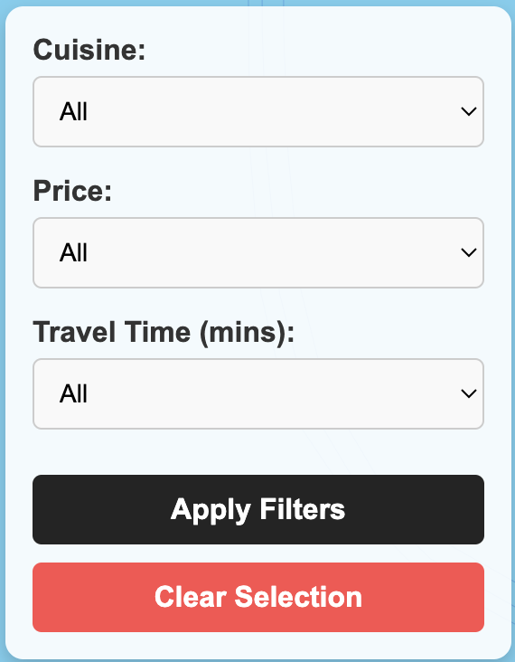
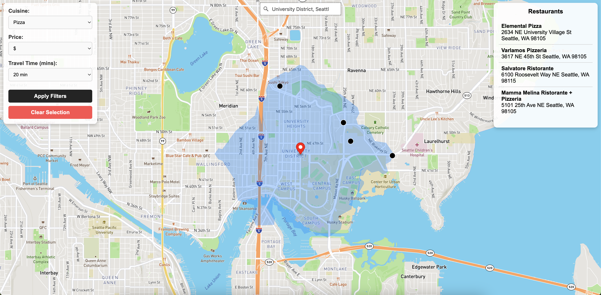
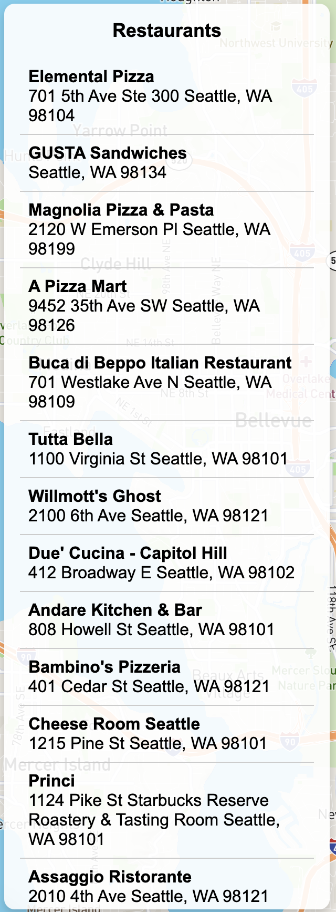
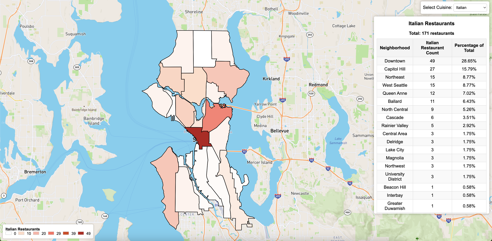
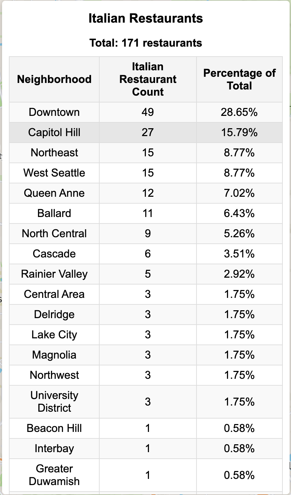
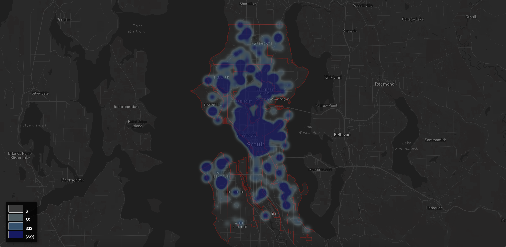
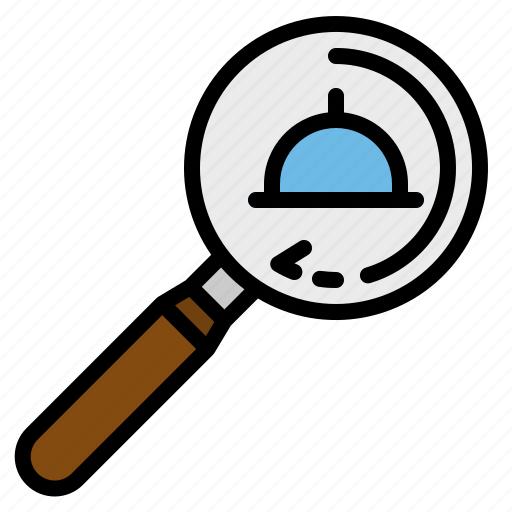

# Seattle Neighborhood Restaurant Finder

### Project Description and Goal

The **Neighborhood Restaurant Finder** is an interactive web map designed to help users explore and discover restaurants in various neighborhoods. The application provides a user-friendly interface to visualize restaurant locations, filter by cuisine type, and view price ranges. Leveraging geospatial data and modern web mapping technologies, the project delivers an engaging and informative experience.

The primary goal of this project is to provide a comprehensive tool for users to explore dining options in their neighborhood or any area of interest within Seattle. By integrating various data sources and interactive features, the application aims to enhance the user's ability to make informed dining decisions based on location, cuisine, and price. This tool not only aids in decision-making for diners but also serves as a strategic resource for business owners looking to establish new restaurants in optimal locations.

### Website Description

The website is designed to categorize different types of restaurants and their cuisine types in Seattle, while also visualizing regions of high and low competition. Users can filter restaurants by cuisine, price range, and popularity. Using spatial analysis, the website highlights dense restaurant clusters and underserved areas. This functionality helps business owners identify optimal locations for new restaurants and provides diners with insights into food hotspots and transit times to reach them.

### Target Audience

The primary target audience includes:

- **Restaurant Owners**: Individuals looking to open new locations can use the website to visualize areas of lower and higher competition. This enables them to strategize about where their restaurant would be most successful and face the least competition.

- **Potential Consumers**: Both tourists and locals can benefit from the website. Tourists can find the highest-rated restaurants to ensure a pleasant dining experience, while locals can discover new dining spots they haven’t visited before.

### Application URL
[Neighborhood Restaurant Finder]()


# Main Functions:

### Interactive Map  
Users can navigate and zoom in/out on the map to explore different neighborhoods. The map provides a visual representation of restaurant density and distribution across Seattle.
### Restaurant Finder Webpage Features

- #### Search Bar  
    The webpage includes a **search bar** powered by Mapbox Geocoder, allowing users to search for and select specific addresses or locations in Seattle. This feature helps users center the map on their desired location and explore nearby restaurants.  

- #### Cuisine Filter  
    Users can filter restaurants by specific cuisine types. The map dynamically updates to display only the restaurants that match the selected cuisine, making it easy to explore dining options based on food preferences.  
    - **Dropdown Menu**: A **dropdown menu** allows users to select from a variety of cuisines (e.g., Italian, Mexican, Korean).  
    - **Dynamic Updates**: When a cuisine is selected, the map updates to show only the restaurants that match the selected cuisine, and the restaurant list on the side panel is filtered accordingly.  
- #### Price Filter  
    Users can filter restaurants by price range to find dining options that fit their budget.  
    - **Dropdown Menu**: A **dropdown menu** allows users to select from price ranges (e.g., \$, \$\$, \$\$\$, \$\$\$\$).
    - **Dynamic Updates**: When a price range is selected, the map and restaurant list update to display only the restaurants within the selected price range.  


- #### Isochrone Map  
    The webpage features an **isochrone map** that visualizes travel time from a selected location.  
    - **Travel Time Selection**: Users can select a travel time (e.g., 10, 20, or 30 minutes) to see areas that are reachable within that time frame.  
    - **Dynamic Updates**: When a travel time is selected, the map updates to display the isochrone layer, showing the reachable area based on the selected travel time.  
    - **Restaurant Filtering**: Restaurants within the reachable area are highlighted on the map and listed in the side panel.  


- #### Restaurant Table (Side Panel)  
    On the right side of the webpage, a **restaurant table** is displayed, providing a list of restaurants that match the selected filters.  
    - **Restaurant Details**: The table includes the following fields for each restaurant:  
        - **Name**: The name of the restaurant.  
        - **Cuisine**: The type of cuisine served.  

- #### Interactive Map  
    The webpage features an **interactive map** that allows users to explore restaurants in Seattle.  
    - **Zoom and Pan**: Users can zoom in/out and pan across the map to explore different areas.  
    - **Restaurant Markers**: Restaurants are displayed as markers on the map, with different colors or icons indicating their cuisine type or price range.  


- #### Apply and Clear Filters  
    - **Apply Filters**: Users can click the **Apply Filters** button to update the map and restaurant list based on the selected cuisine, price range, and travel time.  
    - **Clear Selection**: The **Clear Selection** button resets all filters, allowing users to start a new search.  

### Cuisine Thematic Map  
Users can filter restaurants by specific cuisine types. The map dynamically updates to display only the restaurants that match the selected cuisine, making it easy to explore dining options based on food preferences.
- ### Cuisine Filter  
  - Users can filter restaurants by specific cuisine types. A **dropdown menu** allows users to select from a variety of cuisines (e.g., Italian, Mexican, Korean).  
  - The map dynamically updates to display only the restaurants that match the selected cuisine, making it easy to explore dining options based on food preferences.  
  - When a cuisine is selected, the map, legend, and table all update to reflect the restaurant density for that cuisine, ensuring a seamless user experience.  

- ### Interactive Choropleth Map  
  - The webpage features an **interactive choropleth map** that visualizes restaurant density by cuisine type across Seattle neighborhoods.  
  - Users can navigate and zoom in and out to explore different areas.  
  - Each neighborhood is color-coded based on the density of restaurants for the selected cuisine, with darker colors indicating higher density.  
  - This provides a clear visual representation of where specific cuisines are concentrated.  

- ### Dynamic Legend  
  - The map includes a **dynamic legend** that explains the color gradient used in the choropleth map.  
  - The legend updates based on the selected cuisine and displays the corresponding restaurant counts.  
  - This helps users interpret the map and understand the distribution of restaurants across neighborhoods.  

- ### Restaurant Breakdown Table  
  - On the right side of the map, a **restaurant breakdown table** is displayed, providing detailed insights into the selected cuisine.  
  - The table includes the following fields:  
    - **Neighborhood**: The name of the neighborhood.  
    - **Restaurant Count**: The number of restaurants for the selected cuisine in that neighborhood.  
    - **Percentage of Total**: The percentage of total restaurants for the selected cuisine that are located in that neighborhood.  
  - The table is sorted in descending order by restaurant count, making it easy to identify neighborhoods with the highest density of the selected cuisine.  


- ### Hover-Based Popups  
  - When users hover over a neighborhood on the map, a **popup** appears showing:  
    - The **neighborhood name**.  
    - The **number of restaurants** for the currently selected cuisine in that neighborhood.  
  - This feature provides quick, at-a-glance information without requiring users to click or interact further.  


### Price Density Map  
Users can view restaurants within selected price ranges. This feature helps users find dining options that fit their budget, from affordable to high-end restaurants.

### Price Density Map Webpage Features

- #### Interactive Heatmap  
    The webpage features an **interactive heatmap** that visualizes restaurant price density across Seattle neighborhoods.  
    - **Price Density Visualization**: The heatmap uses color gradients to represent the density of restaurants in different price ranges (e.g., \$, \$\$, \$\$\$, \$\$\$\$).
    - **Dynamic Scaling**: The heatmap scales dynamically as users zoom in or out, ensuring that the density visualization remains accurate and visually intuitive at all zoom levels.  
    - **Color Gradient Explanation**: The legend explains the color gradient used in the heatmap, with darker colors indicating higher restaurant density for a specific price range.  



- #### Seattle Neighborhood Boundaries  
    The map includes clearly marked **Seattle neighborhood boundaries**, allowing users to easily identify and explore specific areas.  
    - **Boundary Lines**: Neighborhood boundaries are displayed as distinct lines, making it easy to distinguish between different areas.  
    - **Interactive Exploration**: Users can zoom in to explore specific neighborhoods and their restaurant price density in detail.  

- #### Base Map Interaction  
    The webpage uses a **Mapbox base map** that provides a detailed and interactive backdrop for the heatmap.  
    - **Zoom and Pan**: Users can zoom in/out and pan across the map to explore different areas of Seattle.  
    - **Map Styles**: The base map style is designed to complement the heatmap, ensuring clarity and readability.  

### Restaurant Details  
Clicking on a restaurant marker reveals more details about the restaurant, such as its name, address, price range, and other relevant information. This provides users with quick access to essential details for decision-making.

## Data Sources
- **Neighborhood Data**: `neighUpdated.geojson`
- **Restaurant Price Data**: `rest_price_updated.geojson`
- **Seattle Restaurants Data**: `seattle_restaurants_final.geojson`

### Favicon

A custom favicon was created using ChatGPT.

## Applied Libraries and Web Services
- **Mapbox GL JS**: For rendering interactive maps.
- **GitHub**: For version control and repository hosting.
- **Basemap**: For providing the base layer of the map.
- **Shapely**: For spatial operations and filtering restaurants within Seattle boundaries.
- **Yelp Fusion API**: For fetching restaurant data.

## Data Cleaning Process
For our project, we used data from the **Yelp Fusion API**, which provides detailed information about restaurants, including latitude, longitude, address, hours, price, and more. Using the API, we created a GeoJSON file of all restaurants in Seattle using a Python script. We selected key attributes for each restaurant, such as name, rating, cuisine type, address, review count, price, phone number, and Yelp URL.

### Step 1: Fetching Data from Yelp Fusion API
We used a Python script (`import_req.py`) to fetch restaurant data from the Yelp Fusion API. The script iterates through predefined categories (e.g., Italian, Mexican, Korean) and price levels (e.g., $ to $$$$) to collect restaurant data. The data is then saved in a GeoJSON format (`seattle_restaurants_filtered.geojson`).

```python
# Example of fetching data from Yelp Fusion API
import requests
import json
import time

API_KEY = "your_yelp_api_key"
YELP_API_URL = "https://api.yelp.com/v3/businesses/search"
HEADERS = {"Authorization": f"Bearer {API_KEY}"}

def fetch_restaurants(category=None, price=None):
    # Fetch restaurants using filters (category, price) and paginate results
    ...
```

### Step 2: Filtering Restaurants Within Seattle

The Yelp API sometimes returns restaurants outside Seattle (e.g., Bellevue or Mercer Island) due to its search algorithm. To ensure we only included restaurants within Seattle, we used a Python script (`filter_within_seattle.py`) with the `shapely` library to filter restaurants based on the `seattle_boundary.geojson` file. This script checks if each restaurant's coordinates fall within Seattle's boundaries and saves the filtered data to `seattle_restaurants_final.geojson`.

```python
# Example of filtering restaurants within Seattle
import geopandas as gpd
from shapely.geometry import Point
import json

seattle_boundary = gpd.read_file("seattle_boundary.geojson")

with open("seattle_restaurants_filtered.geojson", "r") as f:
    yelp_data = json.load(f)

filtered_restaurants = []

for feature in yelp_data["features"]:
    lon, lat = feature["geometry"]["coordinates"]
    point = Point(lon, lat)
    if seattle_boundary.contains(point).bool():
        filtered_restaurants.append(feature)

output_data = {"type": "FeatureCollection", "features": filtered_restaurants}
with open("seattle_restaurants_final.geojson", "w") as f:
    json.dump(output_data, f, indent=4)

```
### Step 3: Neighborhood Classification
We divided Seattle into neighborhoods using the Seattle Open Data Neighborhood Atlas. The neighborhood map and restaurant data were combined to create the final dataset used in the application.

## AI Use Disclosure:
In the development of this project, ChatGPT was utilized to assist with various aspects of the work:  
- **Code Skeleton and Navbar Tweaks**: AI was used to help build a skeleton of code and refine certain aspects of the navigation bar.  
- **JavaScript Coding and Debugging**: ChatGPT was employed to assist with writing JavaScript code and debugging issues.  
- **Yelp Fusion API Integration**: AI was used to work with the Yelp Fusion API to generate and process the GeoJSON file for restaurant data.
- **Favicon**: A custom favicon was created using ChatGPT.

